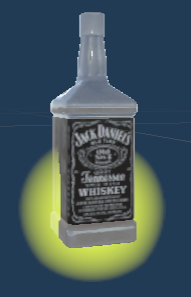
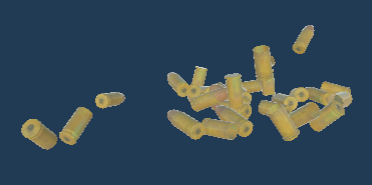
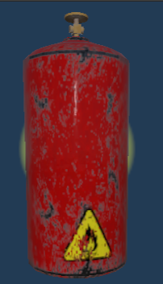
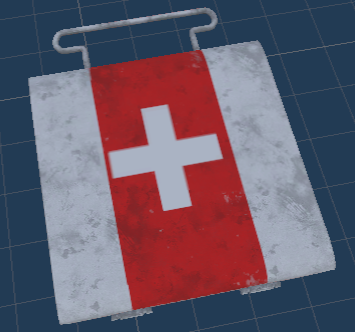
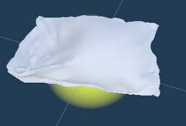
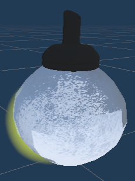
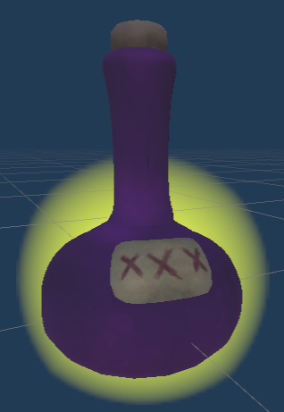

# Official GitHub repository of Game Studio: U Left Us Dead. 
This game was developed by the game studio "U Left Us Dead". The game was fully developed using the Unity game engine, as part of the CSEN903 ACML course.

**Members:**

 1. Gasser Khaled
 2. Islam Nasr
 3. Kariman Hossam
 4. Hana Kamal
 5. Marwan Sadat
 6. Yasser

## Storyline & Gameplay
The main idea here was to create a small and modified version of the “Left 4 Dead” game. All information regarding the original game can be found here: https://left4dead.fandom.com/wiki/Left_4_Dead_Wiki

The player controls the main character called Joel in an indoors or outdoors
environment. He is usually accompanied by a young girl by the name of Ellie or other
companions that the player chooses before gameplay. The goal of the player is to go through all the levels while killing as many infected as possible in order to survive along with his companion. A companion is a character that has neither health points nor can be attacked by the infected. Each companion has a special passive ability that is applied to Joel as long as they are together. Each companion carries a different weapon that he/she can only use whenever Joel orders him/her to.

There are two types of infected in this game; Normal and special. Normal infected are the most common throughout the gameplay. They keep walking around in a specific place and they start to aggressively chase Joel whenever they detect him. Once they start chasing Joel, they will not stop until they or Joel are dead (however, Stun, Pipe, and Bile bombs can be used to temporarily distract them). They can also group up and attack in groups called a horde. They are attracted to loud noises and will start chasing Joel if he fires his weapon near them. They have 50 health points and can cause 5 points of damage per second to Joel. Special Infected, these usually are more difficult to kill and have special abilities that can cause serious damage. There are 4 types of infected in the game: Hunter, Charger, Spitter and Tank.

Joel can carry different weapons throughout the game. Weapons are divided into two
categories; Assault weapons and Grenades. The assault weapons available are: AR, SMG, Shotgun, Shotgun and Sniper. The grenades available are: Molotov Cocktail, Pipe Bomb and Stun Grenade.

Moreover, there's a crafting gameplay mechanic which enables Joel to create useful items from simple supplies/ingredients. Joel can pick up ingredients that are available throughout the game, in order to perform the craft.
|Craft| Ingredients |
|--|--|
| Molotov Cocktail | 2 Alcohol + 2 Rags |
| Stun Grenade | 1 Sugar + 2 Gunpowder
| Health Pack | 2 Alcohol + 2 Rags |
| Pipe Bomb | 1 Alcohol + 1 Gunpowder + 1 Canister |

Here is a list of the items that can be collected from all over the scene:
|Collectable| Picture |
|--|--|
|Alcohol| |
|Ammo Pack| |
|Canister||
|Health Pack||
|Rag||
|Sugar||
|Bile||

#### The game has 3 levels, these are:

 1. Desert, you are supposed to kill all infected in order to proceed to the next level.  
 2. Stealth, you are supposed to collect 20 of the bicylces scattered around the map in order to finish the level. You can collect a bike by approaching it and pressing E, just like you would with any collectable. P.S: Try not to get detected by any of the infected! You can navigate through them unnoticed, be careful ;)
 3. Rescue, your companion has been kidnapped. You must navigate through the map and rescue your companion before the timer runs out! You can free your companion by breaking the cage door (by shooting it) that they are trapped in. You will then have to kill all the infected in the level in order to win.

If you die at any point during the gameplay, you will have to reset and try again the whole level.

## How to Play
*Player Movement:* 

		W: to move forward
		S: to move backward
		A: to move left
		D: to move right
		L. Shift: to run + movement key
		L. Ctrl: to evade + movement key
		Space: to jump
*Player Controls:*

		E: to pick up item (you are close to and aiming at)
		C: to switch weapons
		Z: to switch grenade/bomb
		L. Mouse: to fire current weapon
		R. Mouse: to throw current grenade
		R: to reload weapon
		Q: order companion to fire their weapon
		F: to activate rage mode
	
*Cheats:* (Cheats are to activated only if the **LEFT ALT** button is pressed **simultaneously**. Objects spawn at the location currently aimed at, but must be only 10 meters away)
		
		NumPad 1: Spawn normal infected
		NumPad 2: Spawn special infected 1
		NumPad 3: Spawn special infected 2
		NumPad 4: Spawn special infected 3
		NumPad 5: Spawn special infected 4
		NumPad 6: Add all grenade types to Joel
		NumPad 7: Spawn ammo pack
		NumPad 8: Spawn health pack
		NumPad 9: MAX ammo current weapon
		NumPad +: Spawn horde of 20 infected
		NumPad -: Kill all infected
		NumPad .: Damage all infected with 10 points
		NumPad *: Pause/Unpause timer in rescue level
		NumPad /: Skip to next level (scene)
		H: Add 50 health points to Joel
		M: Add 10 rage points to Joel
		Y: Toggle rage on
		N: Toggle rage off
		,: Add an ammo clip to companion's weapon

 ## Gameplay points to consider:
 
 1. The companion when instructed to shoot their weapon, will prioritize special infected over normal infected. Moreover, it will empty it's weapon's clip in attempt to kill the most infected within it's radius.
 2. In the levels, the infected are unable to climb stairs. They occupy the ground levels and will not chase the player up any stairs.
 3. The infected are stupid, they do not follow the shortest path and will get stuck in obstacles.
 4. The stealth level is hard to pass without being detected, Goodluck! :laughing::laughing:

